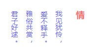
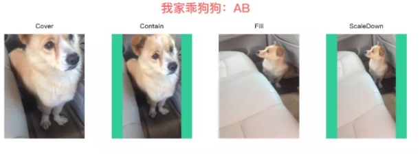
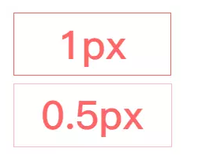
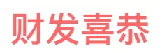
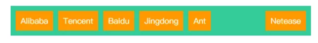
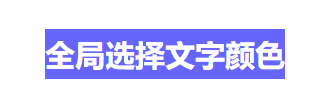
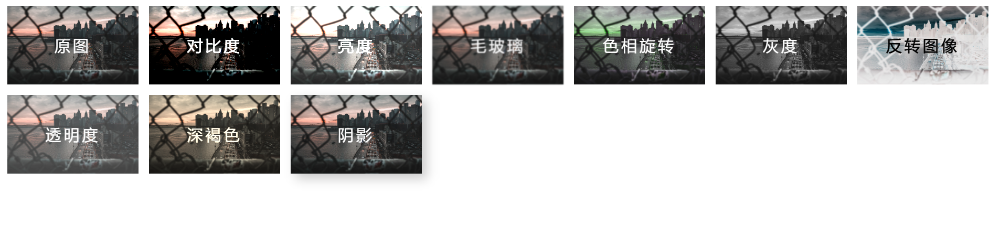

## 布局技巧

布局技巧是什么呢？我喜欢把当作我们在进行页面开发时，为了达到与设计图类似的效果，所用到的一些很多人在开发中不会使用的“捷径”。

#### :wink:使用vw定制rem自适应布局

---

```css
/* 基于UI width=750px DPR=2的页面 */
html {
    font-size: calc(100vw / 7.5);
}
```

vw暂时来说大部分的浏览器还不支持，在日常开发中，可以说是**废的**。

#### :no_mouth:使用:nth-child()来选择元素

---

###### 选择奇数

```css
li:nth-child(odd)
```

###### 选择偶数


```css
li:nth-child(even)
```

###### 从某个数之后
a表示倍数，b表示偏移量
```css
li:nth-child(an + b)
```
###### 负方向范围

```css
li:nth-child(-n+9)
```
使用 `:nth-child(-n+9)`，就相当让你选中第9个和其之前的所有子元素

###### 过滤

```css
li:nth-child(n+2):nth-child(odd) 
```
使用 `:nth-child(3n+1)` 我们可以每隔3个选中一个，也就是第 1, 4, 7 和 10 个子元素，但通过使用 `:nth-child(even)` 我们过滤掉了奇数位子元素，也就是 1 和 7，于是，剩下的子元素只有 4 和 10

###### 前后限制范围

```css
li:nth-child(n+4):nth-child(-n+8)
```
使用 `nth-child(n+4):nth-child(-n+8)` 我们可以选中某一范围内子元素，上面的例子里是从第4个到第8个子元素

#### :unamused:使用writing-mode排版竖文

---


```
//垂直排布，从右往左
writing-mode: vertical-rl;
```


#### :heart_eyes:使用:not()去除无用属性

---

通过`:not()`排除指定元素不使用设置样式
###### 使用:not()去除列表最后一个元素的右边框

```css
li:not(:last-child)
```

#### :sweat:使用object-fit规定图像尺寸

---

通过`object-fit`使图像脱离`background-size`的约束，使用``来标记图像背景尺寸


除了IE以外都支持，可行

#### :hushed:使用overflow-x排版横向列表

---

通过`flexbox`或`inline-block`的形式横向排列元素，对父元素设置`overflow-x:auto`横向滚动查看


#### :sob:使用text-overflow控制文本溢出

---

通过`text-overflow:ellipsis`对溢出的文本在末端添加`...`


#### :yum:使用transform描绘1px边框

---

分辨率比较低的屏幕下显示1px的边框会显得模糊，通过`::before`或`::after`和`transform`模拟细腻的1px边框


```scss
.thin {
	width: 200px;
	height: 80px;
	position: relative;
	&::after {
		position: absolute;
		left: 0;
		top: 0;
		border: 1px solid $red;
		width: 200%;
		height: 200%;
		content: "";
		transform: scale(.5);
		transform-origin: left top;
	}
}
```



#### :two_hearts:使用letter-spacing排版倒序文本

---

通过`letter-spacing`设置**负值**字体间距将文本倒序

**letter-spacing最少是font-size的2倍**



#### :star2:使用margin-left排版左重右轻列表

---

使用`flexbox`横向布局时，最后一个元素通过`margin-left:auto`实现向右对齐




#### :pensive:块级格式化上下文（BFC）

---

如何触发？
+ body根元素
+ 浮动元素中float的值不是none
+ overflow值不是visible
+ display的值是table-cell,table-caption,inline-block任何一个
+ position值不是relative,static


#### :smiley:css优先级

---

+ 每个选择器都有权值，权值越大越优先

+ 继承的样式优先级低于自身指定样式

+ ！important优先级最高 js也无法修改

+ 权值相同时，靠近元素的样式优先级高 顺序为内联样式表（标签内部）> 内部样式表（当前文件中）> 外部样式表（外部文件中）

  

#### :broken_heart:自定义滚动条

---

自定义滚动条时我们能够修改的属性又以下的几种：

`::-webkit-scrollbar` 滚动条整体部分，可以设置宽度啥的
`::-webkit-scrollbar-button` 滚动条两端的按钮
`::-webkit-scrollbar-track` 外层轨道
`::-webkit-scrollbar-track-piece` 内层滚动槽
`::-webkit-scrollbar-thumb` 滚动的滑块
`::-webkit-scrollbar-corner` 边角
`::-webkit-resizer` 定义右下角拖动块的样式

代码：[在线演示](https://codepen.io/sukysukysuky/pen/pozZOXV)


#### :point_right:自定义文本选择颜色

---

```css
::selection{
    background-color:#6736ad;
}
```



#### :no_good:使用linear-gradient文本渲染

---

`filter`内包含的有用的函数有：



代码:[在线演示](https://codepen.io/sukysukysuky/pen/KKPxZeq)

关键点：

+ 通过动画配合`filter`来对文字进行一个渲染。
+ 使用`background-clip`来剪切背景

代码:[在线演示](https://codepen.io/sukysukysuky/pen/zYOJRve)

