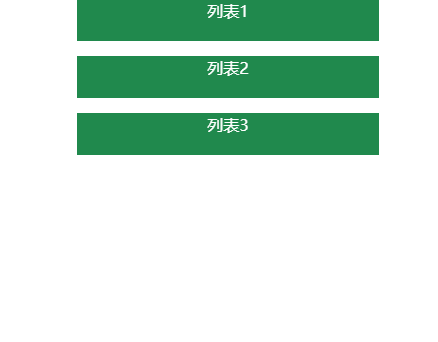

## CSS组件技巧

我们知道CSS的渲染速度是要比JS **快多了**，那我们为了网页更好的一个渲染性能，我们应该在开发中多多尝试用CSS做到JS能做的事。但CSS的一些特性我们要注意，可能各大浏览器厂商还没有支持（恨铁不成钢）。

#### :relaxed:下划线跟随导航栏

主要是通过`before`这一个伪类绘制一个长方形来模拟一个下划线。

代码: [在线演示](https://codepen.io/sukysukysuky/pen/qBWYwEG)

#### :smiley:配合label进行单选框选择

首先我们要知道这个的关键有几点：

+ Input是不应该被显示的
+ 我们想要背景颜色仅仅显示一部分要用到`background-clip:content-box`,制定我们的背景绘制区域

代码: [在线演示](https://codepen.io/sukysukysuky/pen/vYBaVop)

#### :dancers:悬浮式折叠面板

实现的关键：

+ `max-height`的使用

代码：[在线演示](https://codepen.io/sukysukysuky/pen/gOYjQQy)

#### :speak_no_evil:使用`background-attachment: fixed` 实现滚动视差

关键点：

+ `background-attachment:fixed`设置背景图片相对于视口固定

代码：[在线演示](https://codepen.io/sukysukysuky/pen/abojXWb)

#### :fist:使用transform模拟视差滚动

关键点：

+ `background-attachment:fixed`设置背景图片相对于视口固定
+ 给容器设置上 `transform-style: preserve-3d` 和 `perspective: xpx`，那么处于这个容器的子元素就将位于3D空间中
+ 给子元素设置不同的 `transform: translateZ()`，这个时候，不同元素在 3D Z轴方向距离屏幕（我们的眼睛）的距离也就不一样
+ 滚动滚动条，由于子元素设置了不同的 `transform: translateZ()`，那么他们滚动的上下距离 `translateY` 相对屏幕（我们的眼睛），也是不一样的，这就达到了滚动视差的效果

代码：[在线演示](https://codepen.io/sukysukysuky/pen/KKPBbbZ)