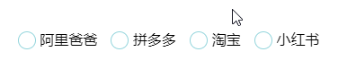

## CSS组件技巧

我们知道CSS的渲染速度是要比JS **快多了**，那我们为了网页更好的一个渲染性能，我们应该在开发中多多尝试用CSS做到JS能做的事。但CSS的一些特性我们要注意，可能各大浏览器厂商还没有支持（恨铁不成钢）。

#### :relaxed:下划线跟随导航栏


主要是通过`before`这一个伪类绘制一个长方形来模拟一个下划线。

代码: [在线演示](https://codepen.io/sukysukysuky/pen/qBWYwEG)


#### :smiley:配合label进行单选框选择



首先我们要知道这个的关键有几点：

+ Input是不应该被显示的
+ 我们想要背景颜色仅仅显示一部分要用到`background-clip:content-box`,制定我们的背景绘制区域

代码: [在线演示](https://codepen.io/sukysukysuky/pen/vYBaVop)


#### :dancers:悬浮式折叠面板


实现的关键：

+ `max-height`的使用

代码：[在线演示](https://codepen.io/sukysukysuky/pen/gOYjQQy)


#### :speak_no_evil:使用`background-attachment: fixed` 实现滚动视差


关键点：

+ `background-attachment:fixed`设置背景图片相对于视口固定

代码：[在线演示](https://codepen.io/sukysukysuky/pen/abojXWb)


#### :fist:使用transform模拟视差滚动


关键点：

+ `background-attachment:fixed`设置背景图片相对于视口固定
+ 给容器设置上 `transform-style: preserve-3d` 和 `perspective: xpx`，那么处于这个容器的子元素就将位于3D空间中
+ 给子元素设置不同的 `transform: translateZ()`，这个时候，不同元素在 3D Z轴方向距离屏幕（我们的眼睛）的距离也就不一样
+ 滚动滚动条，由于子元素设置了不同的 `transform: translateZ()`，那么他们滚动的上下距离 `translateY` 相对屏幕（我们的眼睛），也是不一样的，这就达到了滚动视差的效果

代码：[在线演示](https://codepen.io/sukysukysuky/pen/KKPBbbZ)


#### :see_no_evil:毛玻璃效果


关键点：

+ `clip-path`剪切我们需要处理部分区域
+ `fliter`使用我们滤镜来进行图像处理,我们使用到的是一个叫做`drop-shadow`的属性，他能够让内部的**所有元素都拥有阴影**。

代码：[在线演示](https://codepen.io/sukysukysuky/pen/aboaweV)


#### :car:车车车-能够自己变换颜色的东西


关键点：

+ `mix-blend-mode`能够将元素的内容及背景和其父元素的内容及背景混合起来
+ `input`里面的`type:color`能够让我们的`input`标签拥有拾色器的功能

代码：[在线演示](https://codepen.io/sukysukysuky/pen/BaBqoar)


#### :circus_tent:使用计数器进行计算


关键点：

+ css计数器有两个属性和一个方法，它们分别是：

  + `counter-reset`给计数器起个名字，告诉我们计数器从那个数字开始计数,值得注意的是我们能够进行多个计数器同时命名

    ```css
    .xxx { counter-reset: wangxiaoer 2 wangxiaosan 3; }
    ```

    

  + `counter-increment`表示我们每次计数的变化值。其主要规则能够称为**普照规则**，具体说来就是普照源唯一，每普照一次，普照源增加1次计数值。

  + `counter()`这是个方法，就是用来显示计数的

+ `display:none`时计数器无法正常显示

代码：[在线演示](https://codepen.io/sukysukysuky/pen/vYBVLxb)


#### :bookmark_tabs:构造一张商城票券


关键点：

+ `linear-gradient`这个是css中划时代的一个值，我们来大致说下各个值

```css
background-image:linear-gradient(<渐变线的起始点位置>，<颜色> <颜色终止点>)
```

值得注意的一点是我们能够无限添加其后面的颜色及其终止的位置。当两个颜色终止点重叠的时候，我们会发现颜色将不会有过渡，而会直接进行一个变换。

+ `radial-gradient`也是个神奇的值，我们也来说下各个值

```css
background-image:radial-gradient(<半径大小> <渐变形状> <圆点>，<颜色> <颜色终止点>)
```

和`linear-gradient`类似，他也能无限添加颜色及其终止位置。

+ 最后我们再来讲下`background`这个值拥有的属性

```css
background:<图片路径> <background-position-x> <background-position-y> / <background-size> <background-repeat>;
```

代码：[在线演示](https://codepen.io/sukysukysuky/pen/WNeaoBy)


#### :clinking_glasses:可切换内容的标签页


关键点：

+ `input`和`label`之间拥有一种锚点的关系，当我们的东西没有显示在我们的区域内的时候，他会进行定位然后让其出现在我们区域之中。与此相似的还有`label`和`href`

代码：[在线演示](https://codepen.io/sukysukysuky/pen/RwbqJvr)