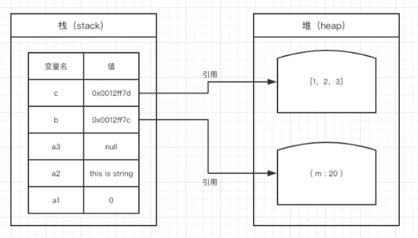
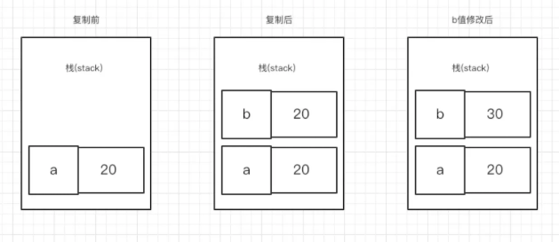
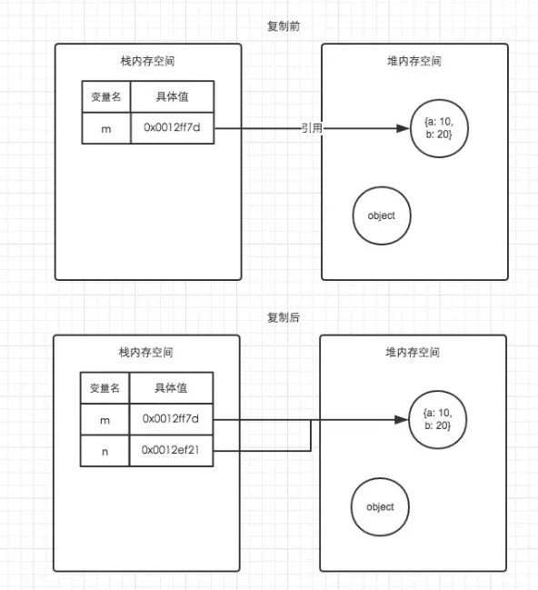
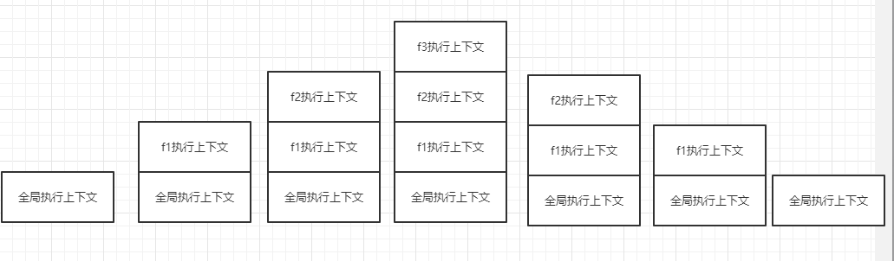
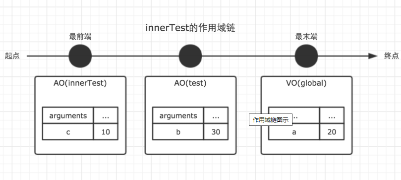

# 前端原理宝典


## 一、开始

作为个前端小渣渣，我觉得我很多的知识其实是杂乱的，就像一个杂乱的房间一样，其实储存的空间还很大，但因为东西乱摆放，很多新的东西就无处落脚了，于是，我就希望把我知道的，从别人学习来的知识进行一个整理，让我未来学的新的知识有位置摆放起来。

## 二、分类

我将前端的学习主要分为这几个部分：

+ JavaScript基础
+ 浏览器相关
+ 请求与响应
+ 功能辅助
+ 功能实现
+ 前端常用数据结构


## 三、JavaScript基础

#### 写在开头

这一章，我所认为的是，这些就是一些公认的定理啊、公式之类的东西，他深究起来并没有多大的意义，因为语言本来就是人为编写的，我们最多能够了解他们设计之初的一个设计思想来帮助我们更好的去理解，但是这些东西，今天不会变，明天也不会变，本质来说，我们只需要熟记即可。

#### 3.1 JS中的内存机制

我习惯于学习一个东西的时候从一些很基础的东西开始说起，比如JS的内存，这是导致了之后的闭包、原型链等东西的关键，如果我们对于这些简单的东西都无法理解，那么我觉得之后的东西也很难被理解。

+ JS中的内存主要分为两种：**栈内存** 和 **堆内存**
+ 栈内存的用途在于储存**基础的数据类型**，堆内存则是储存**引用数据类型**，引用数据类型，一般就是函数或者是数组、对象等。
+ JS中是不允许我们直接访问堆内存，我们只能通过**栈内存中获得堆内存的地址**，再去**索引引用**



+ 复制时，栈内存内的内容将会被完全复制一份到**新的栈内存**，而堆内存的复制，仅仅是复制了**栈内存中储存的堆内存的引用**，而不会复制一份堆内存





#### 3.2 词法（静态）作用域&动态作用域

+ JS的函数作用域是在函数定义时决定的，因此它的作用域称为**词法作用域**
+ 词法作用域找值的方式是根据**函数定义的位置**
+ 动态作用域找值得方式则是根据我们**函数执行的位置**

```javascript
var value = 1;

function foo() {
    console.log(value);
}

function bar() {
    var value = 2;
    foo();
}

bar();

// 结果是 ???
```

假设JavaScript采用静态作用域，让我们分析下执行过程：

执行 foo 函数，先从 foo 函数内部查找是否有局部变量 value，如果没有，就根据书写的位置，查找上面一层的代码，也就是 value 等于 1，所以结果会打印 1。

假设JavaScript采用动态作用域，让我们分析下执行过程：

执行 foo 函数，依然是从 foo 函数内部查找是否有局部变量 value。如果没有，就从调用函数的作用域，也就是 bar 函数内部查找 value 变量，所以结果会打印 2。

前面我们已经说了，JavaScript采用的是静态作用域，所以这个例子的结果是 1。


#### 3.3 执行上下文栈

上面说到我们判断我们的值究竟是运行哪一个，主要是根据**位置**，但是在学术上来说，其实这是和**作用域链**有关，那想要了解作用域链，我们又要先了解下执行上下文栈。

+ JS执行程序是按照“一段一段”的方式分析的代码，当执行一段函数之前，我们会进行一个“准备工作”，叫做**执行上下文**
+ 划分代码段落的主要根据是**函数**

+ 执行上下文栈储存我们划分的每一段的**执行上下文**，并按栈顶到栈底顺序拿出来执行
+ 执行上下文栈中栈底必然会有我们的**全局执行上下文**，浏览器关闭时才会出栈


这个东西直接讲有点难明白，我们直接看实例把。

```javascript
function fun3() {
    console.log('fun3')
}

function fun2() {
    fun3();
}

function fun1() {
    fun2();
}

fun1();
```

上面这段代码，将会在运行之前形成如下得执行上下文栈。



我们将执行上下文栈叫做`ECStack`,我们通过从上往下的运行，我们将我们需要执行的代码一个个的压入栈中。当这个准备工作完成了之后我们就会开始从栈顶往下顺序执行。

[详解](https://segmentfault.com/a/1190000012646203)

#### 3.4 作用域链

+ 函数的内部属性`[[scope]]`，在创建之时就会**保存所有的父变量对象在其中**，这是我们能够实现闭包的**关键**，也是我们**作用域链的基础**

+ 作用域链只可**向上搜索**，不可向下搜索
+ 作用域链的生成时机是在**执行上下文生命周期内**
+ 作用域链由**当前环境与上层环境一系列的变量对象（VO）组成**，与之类似的还有个概念叫做激活对象（AO）
+ 函数激活时，我们创建作用域链，值为`Scope = [AO].concat([[Scope]])`

```javascript
var a = 20;

function test() {
    var b = a + 10;

    function innerTest() {
        var c = 10;
        return b + c;
    }

    return innerTest();
}

test();
```

在上面的例子中，全局，函数test，函数innerTest的执行上下文先后创建。我们设定他们的变量对象分别为VO(global)，VO(test), VO(innerTest)。而innerTest的作用域链，则同时包含了这三个变量对象，所以innerTest的执行上下文可如下表示。

```javascript
innerTestEC = {
    VO: {...},  // 变量对象
    scopeChain: [VO(innerTest), VO(test), VO(global)], // 作用域链
}
```



[看我](https://github.com/mqyqingfeng/Blog/issues/6)

#### 3.5 声明提升

简单来说，我们整段JS代码在运行之前将会对所有的函数及变量进行一个声明，什么是声明呢？就是让我们的工作环境知道，我们有A、B、C的函数或者变量，其实我们可以理解为上课之前老师会喜欢点名，看看这节课究竟谁来了。那对于声明提升，我们需要记住的主要是下面的几点：

- 在**当前作用域**内包括变量及函数在内的所有声明都会在**代码执行前**处理
- function关键字是整个声明的第一个词时，我们才叫他为**函数**，不然的话只能叫**函数表达式**
- 函数提升**优先级最高**，将会是第一个被提升的

例题:

```javascript
function foo() {
   var a = 1;        
   function b() {   
      a = 10;
      return '';
      function a() {...}
    }
    b();
    console.log(a);         // ?
}
foo();
```

解析：

```javascript
//第一层声明
function foo(){
    //第二层声明
    var a;
    function b(){
        //第三层声明
        function a(){} //函数声明时优先级最高
        a = 10; //第二层已经声明，仅重新赋值
        return '';
    }
    a = 1;
    b();
    console.log(a); //1
}
```


#### 3.6 闭包

+ 闭包的用途就是用来**在函数外部读取函数内的局部变量**的，
+ 他还有个副产品，就是**让与其有关的变量的值始终在内存中**
+ 即使我们函数上下文已经被执行完毕被销毁后，但是与其内部有关的函数在执行上下文初始化时，因为有一个`[[scope]]`属性，所以我们能够在初始化的时候也产生**作用域链**

```javascript
var a = new String('0')
function b() {
  var c = new String('1')
  var d = new String('2')
  function e() {
    console.log(c)
  }
  function f() {
    console.log（d)
  }
  return f
}
a = b()
```

函数在执行的时候，会申请空间创建**执行上下文**，执行上下文会包含函数定义时的作用域链，其次包含函数内部定义的变量、参数等，当函数在当前作用域执行时，会首先查找当前作用域下的变量，如果找不到，就会向函数定义时的**作用域链**中查找，直到全局作用域，如果变量在全局作用域下也找不到，则会抛出错误。

[看我](https://github.com/mqyqingfeng/Blog/issues/9)


####  3.7 this的那些事


#### 3.8 原型及原型链

- `_proto_`和`constructor`是对象独有的
- `prototype`是函数独有的，指向函数的原型对象
- `_proto_`由一个对象指向一个原型对象（父对象），不断向上查找直到看到`null`，这样一直向上查找叫做原型链
- `constructor`对象指向一个函数，`ScratchCard.prototype = {}`手动设置`prototype`对象时会导致`constructor`属性赋值到不一样，因此需要重新赋值

#### 3.9 JS浮点数运算精度问题


## 四、浏览器相关

#### 4.1 浏览器缓存机制

#### 4.2  信息本地储存的方式

- Cookie 这个应该说是和浏览器一起出现的最为古老的储存方式，其特点有：
  - 最大储存为4KB
  - 储存个数一般不能超过**20个**
  - AJAX请求时会不断地将cookie**发送给服务端**

```javascript
//设置cookie
function setCookie(name,value,expiredays){
    var exdate = new Date()
    exdate.setTime(Number(exdate) + expiredays)
    document.cookie = name + "=" + encodeURI(value) + ((expiredays == null) ? "":";expires=" + exdate.toGMTString())
}
```


- sessionStorage和localStorage
  - sessionStorage 是储存在**会话**中的数据，会话关闭，数据也将不再保存，localStorage则是**一直储存**在客户端，直到用户本人主动清除
  - 储存的数据将**不再发送给服务端**
  - Storage仅储存**字符串**，其他格式是不予储存的，所以其他格式需要`JSON.stringify()`
- indexedDB 是一个在浏览器内部的非关系数据库,他能够储存相对复杂一点的数据
  - **储存空间巨大**，空间不少于250MB
  - 支持事务，即一系列步骤操作中，一步失败将会回滚到事务发生之前的状态
  - **同源限制**，网页只能访问自身域名下的数据库

indexedDB的使用： [看我](https://www.zhangxinxu.com/wordpress/2017/07/html5-indexeddb-js-example/)

## 五、请求与响应

#### 5.1 跨域究竟应该如何解决

#### 5.2 Promise执行的顺序是怎么样的

#### 5.3  JS编码函数方式

- js编码函数`escape()` `encodeURI()` `encodeURIComponent()`都是用来进行浏览器编码的函数，那为什么说我们有浏览器编码，本质上是因为**URL仅使用英文字母、阿拉伯数字和某些标点符号**
  - `escape()`是最古老的编码函数，现在已经不太常用了，他返回的是字符的**Unicode编码值**，escape不对“+”号编码
  - `encodeURI()`对整个URL编码，特殊符号也不编码，输出符号是utf-8形式
  - `encodeURIComponent()`仅仅对部分URL进行编码，与`encodeURI()`的编码方式类似

## 六、功能辅助

## 七、功能实现

#### 7.1 前端刮刮卡

- `canvas`能够允许我们将图片绘制在上面，但是我们值得注意的是，如果我们的图片与我们的代码是在不同源上时，我们进一步操作，例如`getImageData()`时多半将会发生错误。[解决办法](https://www.zhangxinxu.com/wordpress/2018/02/crossorigin-canvas-getimagedata-cors/)
- `canvas`中有个属性是`globalCompositeOperation`，他表示我们如何将新的笔触绘制在我们的`canvas`画布上，他的属性有这些:


我们可以根据需要选择不一样的来设置。

- 获取我们`canvas`的相对位置，我们来分析下各个值的用处：
  - `offsetLeft`返回当前元素相对于其最近的定位父元素（即设置了position属性）的左偏移值
- `scrollLeft`返回元素滚动条到元素左边的距离
- `clientWidth`内容的可见宽度


- 获取某点的位置：
  - `e.pageX` 代表的相对于文档的坐标
- `e.clientX`代表的时候相当于浏览器窗口可视区域的坐标
- 移动端是：`e.touches[0].clientX`点击时的位置相对于浏览器最左边的距离
- 移动端中`e.changedTouches`代表的是所有触点的数组坐标
- `obj.getBoundingClientRect()`返回元素的大小及相对于其视口的位置
- passive属性：我觉得这个就是它是用来直接禁止掉默认行为的，而不用等到监听器执行后才能够知道是否要使用默认行为


- `getImageData`的信息，他能够获取每个像素的值，但是他数据的储存方式是这样的：a[0] =  R ,a[1] = G,a[2] = B ,a[3] = A,即一个像素的信息其实应该对应四个值。

代码：[在线演示](https://codepen.io/sukysukysuky/pen/dybEawV)


## 八、前端常用数据结构

