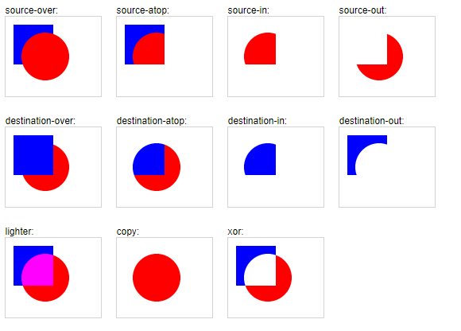
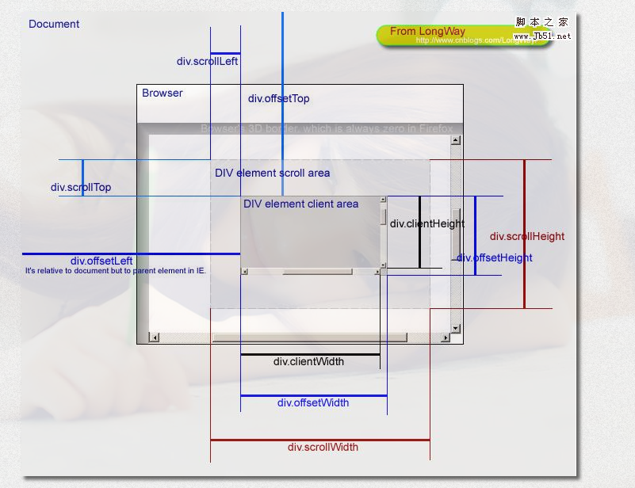
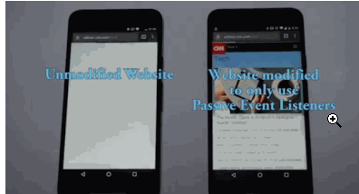

## PLAN FOR 100 DAYS：

+ <a href="#1">~~DAY 1：声明提升~~</a>

+ <a href="#2">~~DAY 2: 实现前端刮刮卡效果~~</a>

DAY 2: JS储存的方式

DAY 3：跨域究竟应该如何解决

DAY 4: Promise执行的顺序是怎么样的

DAY 5: JS中事件循环机制

DAY 6：闭包的作用

DAY 7：原型及原型链

+ `_proto_`和`constructor`是对象独有的
+ `prototype`是函数独有的，指向函数的原型对象
+ `_proto_`由一个对象指向一个原型对象（父对象），不断向上查找直到看到`null`，这样一直向上查找叫做原型链
+ `constructor`对象指向一个函数，`ScratchCard.prototype = {}`手动设置`prototype`对象时会导致`constructor`属性赋值到不一样，因此需要重新赋值

DAYS 8：重绘及回流

DAYS 9：如何实现一个深拷贝

DAY 10: JS浮点数运算精度问题

DAY 11：浏览器缓存机制

DAY 12：页面的性能优化

DAY 13：双向绑定原理

DAY 14：数据结构-----数组

DAY 15：数据结构-----链表

DAY 16：数据结构-----堆栈

DAY 17：数据结构-----队列

DAY 18：数据结构-----哈希表

DAY 19：判断对象的数据类型

DAY 20：循环实现数组的map方法

DAY 21:使用 reduce 实现数组 map 方法

DAY 22:实现 ES6 的 class 语法

DAY 23:函数柯里化

DAY 24:实现函数 bind /call方法

DAY 25:图片懒加载

DAY 26:实现 Object.assign

DAY 27:洗牌算法

DAY 28:单例模式

DAY 29:发布订阅 EventEmitter

DAY 30:数据结构-----二分查找

DAY 31:正则表达式---字符及位子匹配

DAY 32:正则表达式---括号的作用/回溯法原理

DAY 33:正则表达式---拆分/构建/编程

DAY 34:浏览器的主要组成部分

DAY 35: 实现前端刮刮卡效果

DAY 36: 什么是性能监控

DAY 37: CMS系统实现计划

DAY 38: 把我们csv和excel转化成Json

DAY 39:微信浏览器禁止页面下拉查看网址且不阻止拖拽事件


### <span id = '1'>DAY 1:什么是声明提升？</span>

----

+ 在**当前作用域**内包括变量及函数在内的所有声明都会在代码执行前处理
+ function关键字是整个声明的第一个词时，我们才叫他为函数，不然的话只能叫函数表达式
+ 函数提升优先级最高，将会是第一个被提升的

例题:

```javascript
function foo() {
   var a = 1;        
   function b() {   
      a = 10;
      return '';
      function a() {...}
    }
    b();
    console.log(a);         // ?
}
foo();
```

解析：

```javascript
//第一层声明
function foo(){
    //第二层声明
    var a;
    function b(){
        //第三层声明
        function a(){}
        a = 10; //第二层已经声明，仅重新赋值
        return '';
    }
    a = 1;
    b();
    console.log(a); //1
}
```


### <span id = '2'>DAY 2: 实现前端刮刮卡</span>

---

+ `canvas`能够允许我们将图片绘制在上面，但是我们值得注意的是，如果我们的图片与我们的代码是在不同源上时，我们进一步操作，例如`getImageData()`时多半将会发生错误。[解决办法](https://www.zhangxinxu.com/wordpress/2018/02/crossorigin-canvas-getimagedata-cors/)

+ `canvas`中有个属性是`globalCompositeOperation`，他表示我们如何将新的笔触绘制在我们的`canvas`画布上，他的属性有这些:



我们可以根据需要选择不一样的来设置。

+ 获取我们`canvas`的相对位置，我们来分析下各个值的用处：
  	+ `offsetLeft`返回当前元素相对于其最近的定位父元素（即设置了position属性）的左偏移值
  	+ `scrollLeft`返回元素滚动条到元素左边的距离
  	+ `clientWidth`内容的可见宽度



+ 获取某点的位置：
  	+ `e.pageX` 代表的相对于文档的坐标
  	+ `e.clientX`代表的时候相当于浏览器窗口可视区域的坐标
  	+ 移动端是：`e.touches[0].clientX`点击时的位置相对于浏览器最左边的距离
+ passive属性：我觉得这个这样记得一件事就是它是用来直接禁止掉默认行为的，而不用等到监听器执行后才能够知道是否要使用默认行为



+ `getImageData`的信息，他能够获取每个像素的值，但是他数据的储存方式是这样的：a[0] =  R ,a[1] = G,a[2] = B ,a[3] = A,即一个像素的信息其实应该对应四个值。

代码：[在线演示](https://codepen.io/sukysukysuky/pen/dybEawV)


